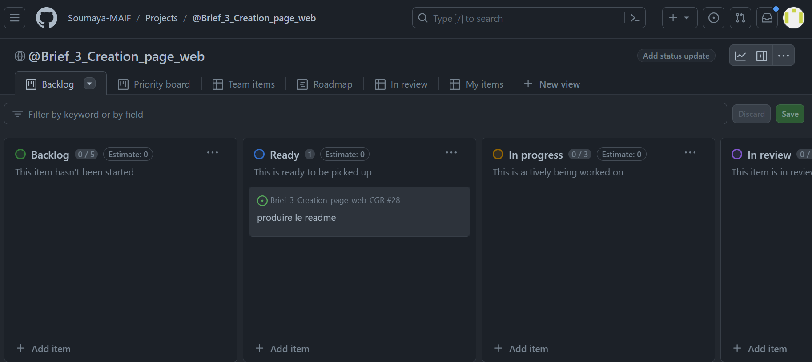

# Brief 3: Creation d'une page web GCR

## Description du projet

Pour le 3eme Brief, il nous a été demandé de développer une page web dynamique pour un cinéma

Les attendus sont: 
- une page web dont le HTML, le CSS et le Javascript sont fonctionnels et responsive  
- La page web doit être fluide et réactive
- Le code doit être propre, bien commenté et documenté.
- L'utilisation de l'API CGR Cinéma doit être conforme à la documentation officielle.
- Utilisation des outils GitHub pour la gestion des tâches
- Le code source doit être hébergé sur un repo sur github

## Organisation

Nous nous sommes servi du Kanban mis à disposition par Github pour nous permettre d'organiser notre travail en découpant sa réalisation en taches, de  VS Code en tant qu'éditeur de code et de l'extension "Live Server" pour suivre l'évolution du développement de la page. 

Nous nous sommes beaucoup servis du debugger du navigateur pour inspecter notre code et resoudre nos erreurs 

## Déroulé du projet

Pour la réalisation de ce projet, nous avons démarré par la prise en main du Kanban mis à disposition par Github permettant la gestion du projet via la creation d'issues et de branches par tache

### Le Kanban

La première difficulté rencontrée a été de prendre la mesure du travail à réaliser afin de nous permettre de déterminer la liste des taches et leur assignation

Après avoir créé une liste de taches sur le Kanban, nous avons commencé par nous familiariser avec l'API et son fonctionnement

### Les Fetchs

La première tache était de réussir à récupérer les films à afficher sur la page d'accueil via un fetch sur l'API ThemovieDB   

Pour réussir à récupérer les données nécessaires à la réalisation de la page, il a fallu comprendre le fonctionnement du site avec l'utilisation du token permettant l'accès aux données  

### Affichage des films sur la page d'accueil

  
La tache suivante fut d'afficher les informations relatives aux différents films affichés sur la page d'accueil  
La difficulté principale de cette tache fut de récupérer la liste des genres pour afficher les genres respectifs de chacun des films affichés

### Affichage des détails du film selectionné avec bouton de retour à l'accueil

Nous avons ensuite travaillé sur l'affichage du film sélectionné sur la page `détail.html`  
L'affichage des détails du film sélectionné a nécessité la récupération de l'id du film et sa réutilisation via l'url via l'utilisation de la propriété `document.location.href` qui renvoie l'URL de la page actuelle.

### Affichage du casting du film

Pour continuer à s'exercer nous avons enrichi la page détail avec l'affichage du casting du film selectionné

### Mise en place d'un filtre de recherche par genre

Nous avons ensuite choisi de d'enrichir notre page d'accueil d'un filtre de recherche par genre 
La selection d'un genre genere un fetch qui récupere les films appartenant à la catégorie selectionné

